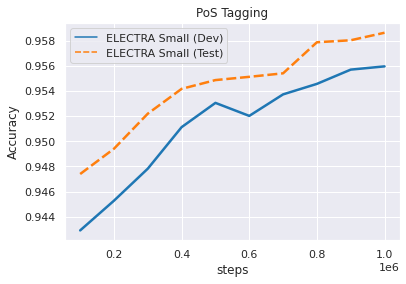
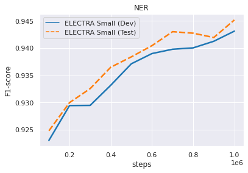

# Turkish ELECTRA models

We release small and base ELECTRA models for Turkish, that were trained on the same data as *BERTurk*.

> ELECTRA is a new method for self-supervised language representation learning. It can be used to
> pre-train transformer networks using relatively little compute. ELECTRA models are trained to
> distinguish "real" input tokens vs "fake" input tokens generated by another neural network, similar to
> the discriminator of a GAN.

More details about ELECTRA can be found in the [ICLR paper](https://openreview.net/forum?id=r1xMH1BtvB)
or in the [official ELECTRA repository](https://github.com/google-research/electra) on GitHub.

# Evaluation

We train both small and base ELECTRA models for 1M steps and do intrinsic and extrinsic evaluations.
Extrinsic evaluations are done for PoS tagging and NER. During pre-training checkpoints were written
every 100k steps. For the final evaluation on downstream taks we evaluate all 10 checkpoints.
We use the same datasets for evaluation as for [*BERTurk*](https://github.com/stefan-it/turkish-bert#evaluation).

Averaged Accuracy (PoS tagging) or averaged F1-Score (NER) over 5 runs for each checkpoint is reported.
That means 50 experiments on each downstream task were performed to select the best and final checkpoint
for the model release.

Evaluation is done with the Hugging Face Transformers library and the [token classification](https://github.com/huggingface/transformers/tree/master/examples/token-classification)
example script `run_ner.py`. We use the following hyper-parameters:

| Parameter       | Value
| --------------- | -----
| `batch_size`    | 16
| `learning_rate` | 5e-5
| `num_epochs`    | 10

# ELECTRA small

The ELECTRA small model was trained with the official implementation. The TensorBoard for ELECTRA small
can be found [here](https://tensorboard.dev/experiment/x8OO1Q6aRCyC5rkXQrEfEw).

## PoS Tagging

The following figure shows evaluation on PoS tagging:

Results for the best checkpoint (Development set results in brackets):

| Checkpoint | Run 1             | Run 2             | Run 3             | Run 4             | Run 5             | Avg.
| ---------- | ----------------- | ----------------- | ----------------- | ----------------- | ----------------- | -----------------
| 1M steps   | (0.9567) / 0.9584 | (0.9578) / 0.9589 | (0.9564) / 0.9591 | (0.9544) / 0.9585 | (0.9545) / 0.9582 | (0.9560) / 0.9586

## NER

The following figure shows evaluation on NER dataset:

Results for the best checkpoint (Development set results in brackets):

| Checkpoint | Run 1             | Run 2             | Run 3             | Run 4             | Run 5             | Avg.
| ---------- | ----------------- | ----------------- | ----------------- | ----------------- | ----------------  | -----------------
| 1M steps   | (0.9447) / 0.9468 | (0.9421) / 0.9439 | (0.9421) / 0.9471 | (0.9428) / 0.9434 | (0.9439) / 0.9447 | (0.9431) / 0.9452
